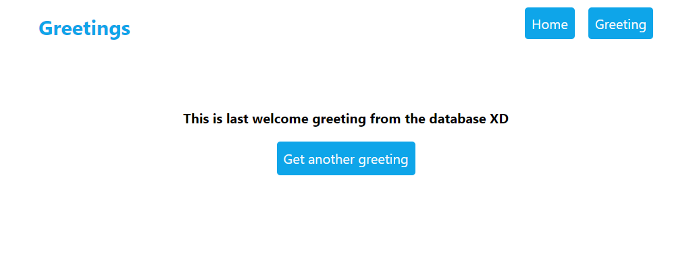

# Hello React Front End app

> Hello React Front End app is simple application that contains setup of react application. The greeting page loads a random greeting from API on every page load.

## Preview

### Home Page


### Greeting Page




## Link to the back end

[Hello Rails back end](https://github.com/KayLemba/hello-rails-backend)

## Built With

- HTML
- CSS
- JavaScript
- REACT
- Redux
- Webpack

## Getting Started

To get a local copy up and running follow these simple example steps.

### Prerequisites
- A text editor(preferably Visual Studio Code)
- Node
- Web browser

### Install
- [Git](https://git-scm.com/downloads)
- [Node](https://nodejs.org/en/download/)

### Using it Locally

- Clone the project

```bash 
git clone https://github.com/KayLemba/hello-react-front-end.git

cd hello-react-front-end
```

- Install dependencies

```bash
npm i 
or
npm install
```

- To Start the development server
```bash
npm start
```


## Visit And Open Files

[Visit Repo](https://github.com/KayLemba/hello-react-front-end.git)

## Download Repo

[Download Repo](https://github.com/KayLemba/hello-react-front-end.git)

## Authors

👤 **Kalolo Chola Lemba**

- GitHub: [@KayLemba](https://github.com/KayLemba)
- Twitter: [@King-Kaylo1](https://twitter.com/King_Kaylo1) 
- LinkedIn: [@kalolo-lemba](https://www.linkedin.com/in/https://www.linkedin.com/in/kalolo-lemba)


## 🤝 Contributing

Contributions, issues, and feature requests are welcome!

Feel free to check the [issues page](https://github.com/KayLemba/hello-react-front-end/issues).

## Show your support

Give a ⭐️ if you like this project!

## Acknowledgments

- Inspiration: Microverse

## 📝 License

This project is [MIT](./LICENSE.md) licensed.
